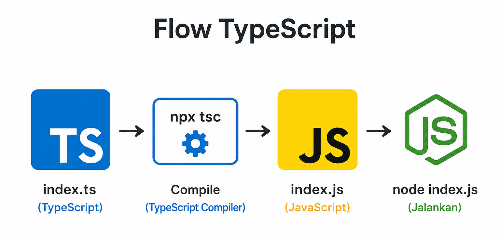

# Compile TypeScript (TS) ke JavaScript (JS)

## Step by Step Lengkap

### 1. Buat Folder Project

mkdir belajar-typescript

### 2. Masuk ke Folder Project

cd belajar-typescript

### 3. Inisialisasi NPM

npm init -y

### 4. Install TypeScript

npm install typescript --save-dev

### 5. Cek Versi TypeScript

npx tsc -v

### 6. Generate File Konfigurasi

npx tsc --init

---

## Struktur Project

belajar-typescript/
│
├── node_modules/
├── package.json
├── package-lock.json
├── tsconfig.json
└── src/
└── index.ts

---

### 7. Buat Folder src

mkdir src

### 8. Buat File TypeScript

code src/index.ts

Isi file:

const name: string = "Vincent";
const age: number = 25;

console.log(`Nama saya ${name}, umur ${age}`);

---

## Compile 1 File

### 9. Compile TypeScript ke JavaScript

npx tsc src/index.ts

Hasil:
src/index.js

---

### 10. Jalankan File JavaScript

node src/index.js

Output:
Nama saya Vincent, umur 25

---

## Compile Seluruh Project

npx tsc

---

## Auto Compile (Watch Mode)

npx tsc --watch

atau

npx tsc -w

---

## Agar Output Masuk ke Folder dist

Edit tsconfig.json

{
"compilerOptions": {
"target": "ES2020",
"module": "commonjs",
"rootDir": "./src",
"outDir": "./dist",
"strict": true
}
}

Compile ulang:
npx tsc

Hasil:
dist/index.js

Jalankan:
node dist/index.js

---

## Tambahkan Script di package.json

"scripts": {
"build": "tsc",
"start": "node dist/index.js",
"dev": "tsc --watch"
}

---

## Menjalankan Script

Build Project:
npm run build

Jalankan Project:
npm run start

Mode Development:
npm run dev

---

## Flow TypeScript

index.ts
↓
npx tsc
↓
index.js
↓
node index.js
